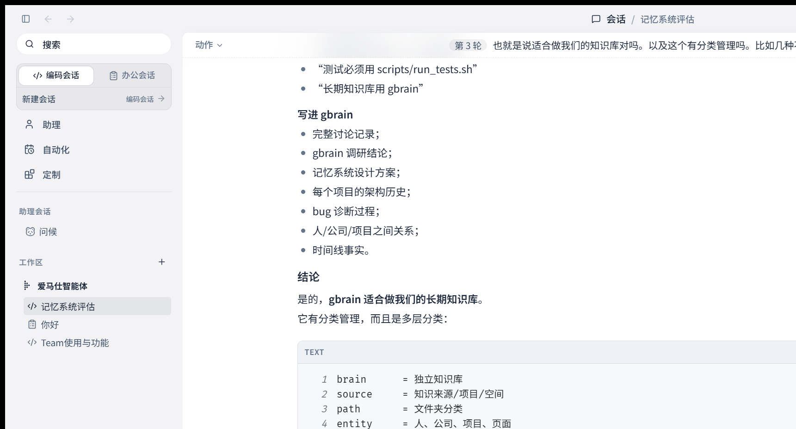
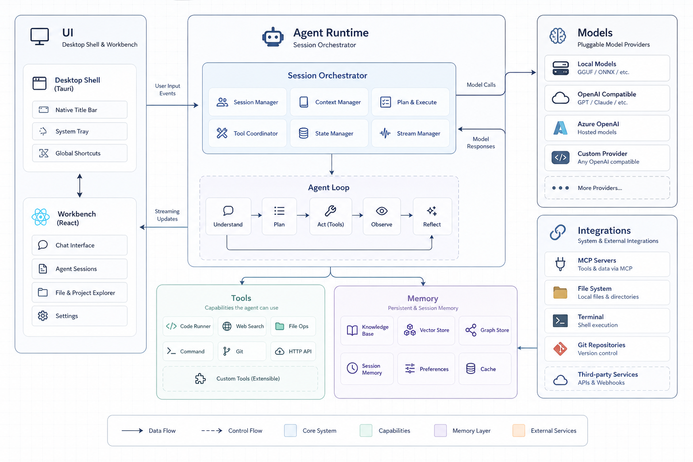
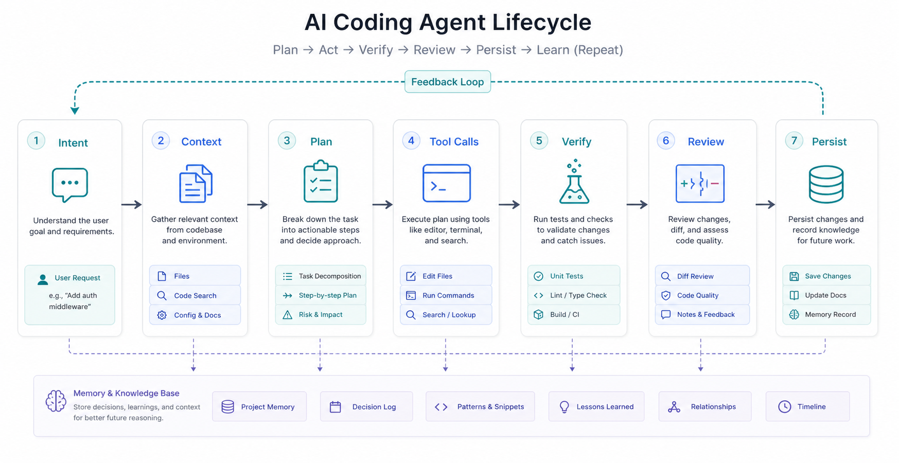
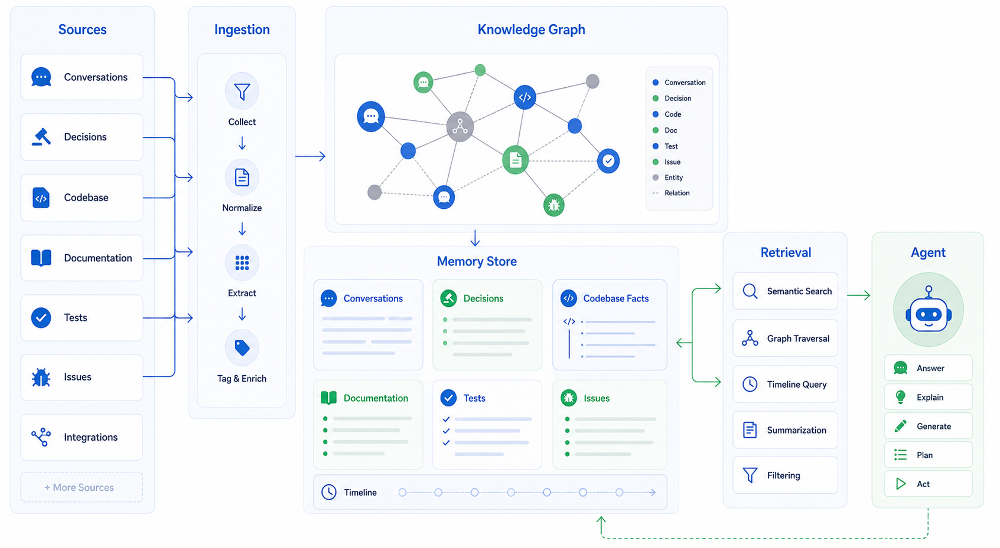
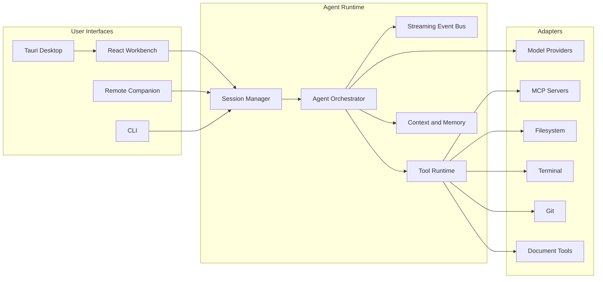

# Void

**A local-first desktop AI agent platform for coding, knowledge work, automation, and extensible agent workflows.**

[](./LICENSE)
[](#platform-support)
[](#technology-stack)
[](./portfolio/)

Void is a production-style desktop application that combines a Rust agent runtime, a Tauri desktop shell, and a React workbench UI. It is designed as a practical AI product and as a portfolio-grade reference project for building inspectable agentic desktop software.

The project focuses on one core idea: an AI assistant should be able to work inside a real developer environment while keeping its actions visible, cancellable, reviewable, and repeatable.

## Live Product Screenshot

The screenshot below is captured from the running desktop app.



## What This Project Demonstrates

Void is not just a chat wrapper. It demonstrates the full product surface required for a desktop AI agent:

- A native desktop shell with local project access.
- A React workbench for chat, sessions, tools, settings, and custom workflows.
- A Rust runtime that coordinates model calls, tool execution, streaming events, cancellation, and persistence.
- File, terminal, Git, document, and MCP-style integrations.
- Long-running sessions designed for engineering work, not one-off prompts.
- Custom agents and skills that can turn repeatable workflows into reusable product surfaces.
- Portfolio and documentation assets suitable for interview review.

## Architecture Gallery

### Runtime Architecture



### Agent Workflow Lifecycle



### Long-Term Knowledge and Memory



## Core Features

| Area | What it demonstrates |
| --- | --- |
| **AI Apps** | Built-in agent surfaces for coding, coworking, personal assistant workflows, automation, mini apps, and generated UI. |
| **Agent Runtime** | Session orchestration, model adapters, streaming events, tool execution, context handling, cancellation, and long-running turn management. |
| **Developer Workflow** | File editing, terminal integration, Git-aware work, code search, code review support, debugging flows, and project navigation. |
| **Knowledge Work** | Document, spreadsheet, presentation, PDF, and research-style workflows through skills and project tooling. |
| **Automation** | Scheduled or repeated AI tasks that can operate against a project workspace and report progress. |
| **Remote Operation** | Companion surfaces for monitoring or controlling long-running work away from the desktop. |
| **Extensibility** | MCP integrations, custom agents, reusable skills, mini apps, and source-level customization. |
| **Observability** | Usage reports, runtime summaries, logs, session records, and visible tool execution. |

## Product Capabilities

### 1. Desktop AI Workbench

Void provides a desktop interface where the user can create sessions, switch between coding and office-style work, inspect previous conversations, and keep work tied to a local project context.

Key surfaces include:

- Agent chat and session views.
- Sidebar workspace navigation.
- Settings and custom agent configuration.
- Automation and scheduled task views.
- Tool output, code blocks, diffs, and execution records.

### 2. Agent Runtime

The runtime coordinates AI work as a structured workflow:

```text
User intent
  -> context gathering
  -> planning
  -> tool calls
  -> streaming progress
  -> verification
  -> review
  -> persistence
```

This makes AI work easier to inspect than a simple request/response chatbot. The product can expose what the agent read, what it changed, which commands it ran, and what verification was performed.

### 3. Tool and Integration Layer

Void is built around explicit tool boundaries. The UI presents actions and state, while the runtime and adapters handle lower-level systems.

Supported integration categories include:

- Filesystem and project files.
- Terminal commands.
- Git repositories.
- Model providers.
- MCP servers and external tools.
- Document-oriented workflows.
- Custom skills and mini apps.

### 4. Long-Term Knowledge Direction

Void is designed to support durable project knowledge instead of relying only on the model context window.

The intended knowledge model includes:

- Conversation history.
- Project decisions.
- Codebase facts.
- Test and verification records.
- Issues and debugging notes.
- Relationship graphs between files, tasks, people, and decisions.
- Timeline-based retrieval for long-running projects.

## Architecture



### Boundary Model

```text
UI / CLI / Remote Surface
  -> module interface
  -> runtime service
  -> adapter
  -> external system
```

The architectural goal is to keep business decisions out of large page components and entrypoints. UI surfaces should render and compose state. Runtime modules should own transformation, status, source, and error handling. Adapters should isolate external systems such as model providers, Git, terminal, files, and MCP servers.

## Repository Map

```text
src/apps/desktop        Tauri desktop host
src/apps/cli            CLI entrypoint
src/apps/server         Server runtime
src/mobile-web          Mobile companion build
src/web-ui              Shared React frontend
src/crates/core         Runtime assembly and shared domain logic
src/crates/ai-adapters  Model provider adapters
src/crates/agent-tools  Tool contracts and execution support
src/crates/transport    Desktop, server, and protocol transport layers
docs                    Documentation and presentation assets
tests/e2e               Desktop E2E test suite
portfolio               English portfolio page for interview review
```

## Technology Stack

| Layer | Stack |
| --- | --- |
| Desktop shell | Tauri 2, Rust |
| Runtime | Rust workspace crates |
| Frontend | React 18, TypeScript, Vite, SCSS |
| Editor and terminal | Monaco Editor, xterm.js |
| AI integrations | Provider adapters, streaming response pipeline, MCP-style integrations |
| Workflow extensions | Skills, custom agents, mini apps |
| Testing | Vitest, TypeScript checks, WebDriverIO-style desktop E2E coverage |
| Build tooling | pnpm, Cargo, Tauri CLI |

## Running Locally

### Prerequisites

- Node.js 18+
- pnpm
- Rust toolchain
- Tauri prerequisites for your operating system

### Install Dependencies

```bash
pnpm install
```

### Start the Desktop App

```bash
pnpm run desktop:dev
```

### Start Only the Web UI

```bash
pnpm run dev:web
```

### Build

```bash
pnpm run build:web
pnpm run desktop:build
```

### Verification Commands

```bash
pnpm run type-check:web
pnpm --dir src/web-ui run test:run
```

## Portfolio Page

An English interview portfolio page is included at:

```text
portfolio/index.html
```

It highlights:

- AI Apps
- Developer Education
- Community Impact
- Talks & Content

The page is static and can be opened directly in a browser or published through GitHub Pages.

## Interview Talking Points

- **Why desktop?** Local AI agents need safe access to files, terminal commands, project context, and long-running workflows. A desktop shell is a practical boundary for that.
- **Why Rust and Tauri?** Rust provides a strong foundation for native capabilities and runtime services, while Tauri keeps the desktop bundle lighter than a full browser shell.
- **Why React?** The workbench needs rich stateful UI: sessions, streaming messages, settings, tool output, code blocks, automation views, and custom agent screens.
- **Why explicit tools?** Tool visibility makes AI behavior reviewable. Users should know what happened before accepting changes.
- **Why memory and knowledge graphs?** Long projects outgrow prompt context. Durable project knowledge helps preserve decisions, debugging history, and architectural context.

## Platform Support

Void is designed for Windows, macOS, and Linux desktop environments through Tauri. Remote and mobile surfaces are companion experiences rather than replacements for the desktop runtime.

## License

Commercial License. See [LICENSE](./LICENSE).
