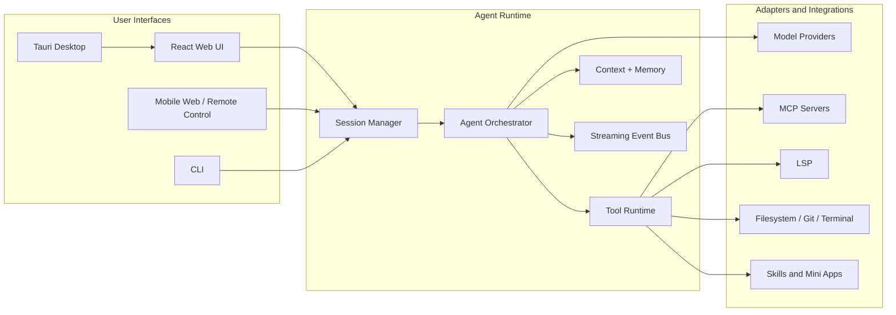

# Void

**A desktop AI agent platform for coding, knowledge work, remote operation, and custom agent workflows.**

[](./LICENSE)
[](#platform-support)
[](#technology-stack)

Void is a production-style desktop application that combines a Rust agent runtime, a Tauri desktop shell, and a React workbench UI. It is designed as both a usable AI app and a portfolio-grade reference project for building agentic desktop software.

The product brings together code agents, document workflows, terminal and file tools, MCP integrations, long-running sessions, remote control, usage reporting, and custom Markdown-defined agents in one local-first desktop experience.

## Product Snapshot


## Core Features

| Area | What it demonstrates |
| --- | --- |
| **AI Apps** | Built-in agent surfaces for coding, coworking, personal assistant workflows, computer-use style actions, mini apps, and generated UI. |
| **Agent Runtime** | Session orchestration, model adapters, streaming events, tool execution, context handling, and cancellable long-running turns. |
| **Developer Workflow** | File editing, terminal integration, Git-aware work, LSP support, code review workflows, debug flows, and project search. |
| **Knowledge Work** | DOCX, XLSX, PPTX, PDF-oriented workflows through skills and document tooling. |
| **Remote Operation** | Mobile-web companion, QR pairing, and remote command surfaces for monitoring work away from the desktop. |
| **Extensibility** | MCP, custom agents, skills, mini apps, and source-level customization. |
| **Observability** | Usage reports, token/runtime summaries, debug logs, and session-level execution records. |

## Screenshots


The current README uses a real desktop application screenshot captured from the running Tauri app. Replace it with fresh captures from the latest desktop build under `docs/assets/` when preparing a release or live demo.

Recommended captures:

- Main agent workspace with chat, file tree, and terminal visible.
- Custom agent or personal assistant configuration screen.
- Session usage report or tool execution summary.
- Mobile/remote control pairing screen.

## Architecture



### Design Principles

- Keep product logic platform-agnostic; expose it through desktop, web, CLI, and remote adapters.
- Treat AI sessions as durable workflows, not short chat messages.
- Keep tools explicit and observable so users can inspect what the agent did.
- Prefer local-first storage and auditable project files.
- Make customization scale from a Markdown-defined agent to source-level product changes.

## Technology Stack

| Layer | Stack |
| --- | --- |
| Desktop shell | Tauri 2, Rust |
| Core runtime | Rust workspace crates |
| Frontend | React 18, TypeScript, Vite, SCSS |
| Editor and terminal | Monaco Editor, xterm.js |
| AI integrations | Provider adapters, streaming response pipeline, MCP support |
| Documents and media | Built-in skills for document/spreadsheet/presentation workflows |
| Testing | Vitest, TypeScript checks, WebDriverIO-based desktop E2E tests |
| Build tooling | pnpm, Cargo, Tauri CLI |

## Repository Map

```text
src/apps/desktop        Tauri desktop host
src/apps/cli            CLI entrypoint
src/apps/server         Server runtime
src/mobile-web          Mobile companion build
src/web-ui              Shared React frontend
src/crates/core         Agent runtime assembly
src/crates/ai-adapters  Model provider adapters
src/crates/agent-tools  Tool contracts and execution support
src/crates/transport    Desktop, server, and protocol transport layers
docs                    Project docs and presentation assets
tests/e2e               Desktop E2E test suite
portfolio               English portfolio page for interview review
```

## Running Locally

### Prerequisites

- Node.js 18+
- pnpm
- Rust toolchain
- Tauri prerequisites for your OS

### Install

```bash
pnpm install
```

### Start the desktop app

```bash
pnpm run desktop:dev
```

### Start only the web UI

```bash
pnpm run dev:web
```

### Build

```bash
pnpm run build:web
pnpm run desktop:build
```

### Checks

```bash
pnpm run type-check:web
pnpm --dir src/web-ui run test:run
```

## Portfolio Page

An English interview portfolio page is included at:

```text
portfolio/index.html
```

Open it directly in a browser, or publish the `portfolio/` directory through GitHub Pages.

The page highlights:

- AI Apps
- Developer Education
- Community Impact
- Talks & Content

## Platform Support

Void is designed for Windows, macOS, and Linux desktop environments through Tauri. Mobile-web and remote-control surfaces are companion experiences rather than a replacement for the desktop runtime.

## License

MIT. See [LICENSE](./LICENSE).
