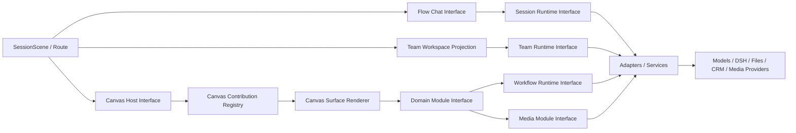

# Void Canvas 插件平台产品与架构规范

状态：当前产品北极星与分阶段实施规范；P0-A、P0-B 已实现并通过退出门，等待 P1-A 批准
更新：2026-08-15
主产品：Void
上游参考：BitFun
前沿参考：DeepSeek Harness（DSH）；本地源码 `D:\codex\DSH`

> 本文固化用户确认的最终产品方向，用于跨会话续作和阶段验收。
> 本文不授权直接开始源码实现；每个实现阶段仍需用户明确批准。

## 1. 一句话产品定义

Void 是一个以会话为中心的 AI 工作空间：中间始终是主 AI 对话，右侧是可折叠、
可展开、可调整宽度、可最大化的 Content Canvas。Canvas 通过类型化插件贡献承载
短剧、媒体、Agent Studio、AI 客服、未来无限画布等专业工作表面；Agent、Team、
Workflow、Skill、Tool、Provider 和 Canvas Surface 可以组合成可安装的业务能力包，
但共享同一套会话、权限、workspace、工具和子代理运行时。

## 2. 已锁定的产品判断

### 2.1 仓库与参考关系

- 本仓库是 Void 主产品和最终实现仓库。
- BitFun 是上游能力与修复来源，不决定 Void 的最终产品形态。
- DeepSeek Harness 是插件架构和生态兼容参考，不是要替换 Void 内核的依赖。
- 外部项目只通过公开契约、适配器和兼容性测试进入 Void；不得整树复制或让外部
  配置格式穿透 Void 的稳定 Module Interface。

### 2.2 “画布”的准确含义

这里的 Canvas 不是另一个全屏“房间”，也不是替代聊天的新首页。它是现有会话场景
右侧的辅助工作区域：

```text
┌──────────┬────────────────────────────┬──────────────────────┐
│ 导航/历史 │ 主会话：用户与当前 Agent/Lead │ Content Canvas       │
│          │                            │ 可折叠 / 展开 / 最大化 │
│          │                            │ 插件表面与领域产物投影 │
└──────────┴────────────────────────────┴──────────────────────┘
```

- 主聊天是任务意图、决策、提问和结果回送的稳定中心。
- Canvas 是右侧可选工作面，不得成为领域数据的真相源。
- Canvas 折叠时，插件状态和任务可以继续；恢复的页签或后台内容不得擅自展开画布。
- 只有用户点击 Canvas 控制或某个能力入口，才能显式展开右侧区域。
- “最大化 Canvas”只是当前表面的呈现模式，不改变会话、workspace、权限或运行时归属。

### 2.3 “一切皆插件”的 Void 解释

Void 采用“所有可扩展能力都有明确贡献点”，而不是“所有东西都塞进一个万能插件
接口”。至少保留以下不同契约：

| 概念 | 负责什么 | 不负责什么 |
|---|---|---|
| Canvas Surface | 右侧工作表面、操作、视图状态 | 领域持久化、会话运行时 |
| Domain Module | 短剧、媒体、客服、销售等领域事实和命令 | 页面布局、远端传输细节 |
| Agent Definition | 专业身份、默认模型策略、可用能力边界 | 工作流进度、UI 页签 |
| Team Definition | Lead、成员、成员策略和协作拓扑 | Canvas 数据、外部系统 IO |
| Workflow Definition | 阶段、依赖、交接、重试和完成条件 | Agent 身份、权限提升 |
| Skill | 可复用操作指导和领域知识 | 运行时权限、workspace 身份 |
| Tool/Capability | 模型可调用的类型化动作 | UI 直接调用、隐式授权 |
| Provider Adapter | 模型、媒体、文件、CRM、DSH 等外部实现 | 产品领域规则 |
| Product Bundle | 按版本组合上述贡献 | 创建第二套会话或工具运行时 |

因此，“不同 Agent/Team 就是不同工作流”在产品层应表达为：不同业务能力包可以绑定
不同的默认 Agent、Team 和 Workflow；但 Agent 身份、Team 拓扑和 Workflow 执行状态
仍是可独立演进、可复用、可测试的类型化对象，不能合并成一段 prompt。

### 2.4 稳定内核、热配置平面与冻结执行平面

Void 不采用 DSH 式“运行中的一切都能替换”。产品原则锁定为：

> 热编辑、隔离试运行、冷发布；只有低风险状态允许热生效。
>
> 配置平面是热的，执行平面是冻结的。

不可由插件在运行时替换的稳定内核：

- Session 事件、恢复日志和 model-visible 事实重建。
- workspace identity、remote identity、权限与审批事实。
- 父子会话 lineage、turn 调度、停止和取消。
- Workflow checkpoint、attempt、revision 和完成验收。
- 插件生命周期、故障隔离和版本兼容判断。
- 领域数据所有权与 Module Interface 写入边界。

开放能力层：

- Canvas Surface 和纯展示配置。
- Agent、Team、Workflow 的版本化定义。
- Skill、Tool 及其受限策略。
- 模型、媒体和其他 Provider seam。
- CRM、客服、销售等外部 Adapter。
- DSH 发现、投影和外部委托兼容桥。

变更激活矩阵：

| 变更 | 激活边界 | 必须记录的事实 |
|---|---|---|
| Canvas 展开、布局、主题、页签 | 立即热生效 | layout revision、workspace/session scope |
| UI 表面纯展示配置 | 立即或下一次渲染 | surface/config revision |
| Agent 名称、头像等纯展示信息 | 可热更新投影，但不改变运行身份 | display revision 与当前 runtime revision 分开 |
| Agent prompt、人格、Skill、工具集 | 发布 immutable revision；新会话或显式分叉生效 | agent revision、能力快照、发布证据 |
| Team 成员、Lead、工作流结构或成员政策 | 新 Team run/instance 生效 | team definition revision、run lineage |
| Agent 定义中的模型或 Provider | 随新 Agent revision 冷生效 | model/provider policy revision |
| 已授权路由内的运行时 Provider failover | 最早下一 turn 边界生效 | `ProviderTurnSnapshot` 与 failover 原因 |
| 新增权限、扩大 workspace 范围 | 重新确认后冷生效 | approval、permission revision、scope |
| 撤销权限、紧急停止、隔离故障插件 | 立即热生效 | revocation/stop/quarantine event |
| Session log、agent loop、lineage、恢复机制 | 仅随 Void 正式版本升级 | core version、migration evidence |

当前会话不得在用户不知情时从 Agent v3 切换到 v4。历史消息、system prompt、Skill、
工具权限、模型策略与上下文缓存都按已绑定 revision 形成；中途偷换会破坏身份一致性、
恢复和排错。展示名称即使热更新，运行详情仍必须显示实际 pinned revision。

## 3. 当前 Void 基线

### 3.1 已存在的正确骨架

当前代码已经具备目标布局的主体：

```text
SessionScene
├── ChatPane                         主对话
├── SessionCapabilityRail            能力入口与 Canvas 显式开关
├── AuxPane                          右侧区域
│   └── ContentCanvas                页签、分栏、最大化、workspace 快照
│       └── FlexiblePanel            根据内容类型渲染实际表面
└── TeamWorkspace                    独立浮层，不是 Canvas 页签
```

必须保留的现有行为：

- 右侧区域由 `rightPanelCollapsed` 控制，具有 resize 和展开/收起能力。
- Canvas 快照按 workspace 隔离。
- AI Short Drama 的绑定可在后台恢复 Canvas 内容，但不自动展开右侧区域。
- `short-drama` 与 `workspace-media` 已经有会话级能力投影和显式入口。
- Team Workspace 是独立的持久 Team 协调面板；成员会话继续使用现有子会话链路。
- MiniApp 已有独立 iframe、Bridge、权限、持久化、版本和 worker 生命周期，不能被
  新 Canvas 插件系统无意替换。

### 3.2 当前扩展瓶颈

当前 Canvas 是“具备插件外形的硬接线系统”，还不是插件平台：

- `PanelContentType` 是硬编码字符串联合；新增表面要修改中心类型。
- `PanelContent.data` 与 `metadata` 使用 `any`，无法形成稳定契约和迁移门禁。
- `FlexiblePanel` 通过大型 `switch` 选择组件，中心文件知道所有业务表面。
- `ContentCanvas` 监听短剧、媒体等全局自定义事件并直接构造页签。
- `SessionCapabilityRail` 的能力 ID、图标和文案表是硬编码映射。
- “会话使用过什么工具”目前被用于推导能力入口；长期应由类型化能力快照与领域
  投影共同决定，不能把 transcript 猜测当作插件安装或授权事实。

这些问题的修复目标不是重写 Canvas，而是用绞杀者方式在现有行为外建立稳定注册表，
再逐个迁移已有表面。

## 4. 目标用户体验

### 4.1 默认会话

1. 用户进入 Code、Cowork 或 Media 场景并创建主会话。
2. 中间区域显示当前 Agent 或 Team Lead 的主对话。
3. 右侧 Canvas 默认保持用户上次明确选择的可见性；后台恢复不得强制展开。
4. 能力栏只显示当前场景、workspace、会话和权限下真实可用的插件表面。
5. 点击能力入口后，Canvas 展开并打开或聚焦对应表面实例。
6. 收起 Canvas 不停止 Agent、Team、Workflow、媒体任务或领域服务。

### 4.2 插件表面

每个表面必须显式呈现以下状态之一：

```text
unavailable | available | opening | ready | empty |
restricted | incompatible | error | quarantined
```

- `empty` 与 `error` 不得通过空数组互相推断。
- `restricted` 必须给出受限能力与可执行的解决方式。
- `incompatible` 必须给出插件契约版本和 Host 支持范围。
- `error` 必须保留最后可用投影，除非该投影已被领域模块判定失效。
- `quarantined` 表示插件已被 Host 隔离；不能把整个 Canvas 或主聊天一起拖垮。

### 4.3 场景、能力包和默认组合

Code、Cowork、Media 继续是稳定的场景包络，而不是专业 Agent，也不直接变成 Canvas
插件。每个场景可以声明默认组合：

| 场景 | 默认 Agent/策略 | 默认能力与 Canvas 表面示例 |
|---|---|---|
| Code | 编码 Agent/代码策略 | 文件、Diff、终端、浏览器、未来代码工作台 |
| Cowork | 通用协作 Agent | 文档、客服、销售、自动化、领域业务表面 |
| Media | 媒体 Agent/媒体策略 | 媒体图库、生成任务、预览与发布 |

用户安装的 Agent/Team 业务包在场景包络内追加或收窄能力，不能绕过场景、workspace、
用户权限和插件权限的交集。

### 4.4 旗舰业务包

| 业务包 | Canvas 贡献 | Agent/Team/Workflow 贡献 | 领域所有者 |
|---|---|---|---|
| Agent Studio | Agent/Team/Workflow 草稿编辑、差异、试聊、验证与发布 | 独立 debug Agent/Team run | Customization Module |
| AI Short Drama | 五阶段画板、阶段产物、媒体预览、最终预览 | Lead + 五个阶段 Agent + 五阶段工作流 | Short Drama Module |
| Workspace Media | 图库、任务队列、预览、保存、回收站 | Media Agent 可选工作流 | Workspace Media Module |
| AI Customer Service | 状态、范围、知识库、规则、诊断 | 客服 Agent/Team 与值守工作流 | Customer Service Module |
| AI Sales Team | 线索、客户、跟进、阶段看板、结果摘要 | Sales Lead + 研究/触达/跟进等成员与工作流 | Sales Module |
| Infinite Canvas | 节点、连线、空间组织和领域投影 | 可绑定任意 Agent/Team/Workflow | Infinite Canvas Module |

Infinite Canvas 是未来可安装表面，不替换 Content Canvas Host，也不自动成为所有领域
的持久化模型。

### 4.5 Agent Studio：Canvas 内的智能体工作室

`Agent Studio` 是第一方 `agent-studio` Canvas contribution，是 Content Canvas 中的
一级 Tab，不是新的独立全屏页面，也不占用左侧主聊天：

```text
左侧主聊天                         右侧 Content Canvas / Agent Studio Tab
当前运行：Agent v3                正在编辑：draft v4
继续按 v3 正常对话                身份 / Skill / 工具 / 模型 / 工作流
session pinnedRevision = v3        独立试聊 / 对比 / 验证 / 发布
```

#### 表面实例与绑定

```text
AgentStudioBinding {
  workspaceId
  sourceSessionId
  agentDefinitionId
  pinnedRuntimeRevisionId
  draftRevisionId
  debugSessionId?
  surfaceInstanceId
}
```

- 左侧 `sourceSessionId` 继续使用 `pinnedRuntimeRevisionId`，编辑期间行为不变。
- 右侧草稿以 `agentDefinitionId + draftRevisionId` 作为稳定编辑身份。
- 同一草稿重新打开时恢复编辑状态；Canvas layout snapshot 只保存上述合法引用。
- 关闭 Tab 不删除草稿，不停止左侧会话，也不把未发布定义设为默认。

#### 草稿和发布状态

```text
editing -> validating -> validated -> publishing -> published
   |            |             |            |
   v            v             v            v
 invalid       failed        stale        conflict
```

- 已发布 revision 不可变；继续编辑必须从某个已发布 revision 创建新草稿。
- 草稿携带 `baseRevisionId`。发布用 compare-and-swap 检查 base/default 指针，避免覆盖
  另一编辑器的新版本。
- `validated` 必须绑定被测试的 draft fingerprint、能力快照、测试用例和验证结果；
  草稿内容变化后原验证立即变为 `stale`。
- 发布是原子动作：定义、revision、索引和可恢复元数据要么一起成功，要么保持旧默认。

#### 隔离 debug 子会话

试聊必须复用现有 Flow Chat/persona runtime，但使用独立会话：

```text
AgentDebugSessionFacts {
  sessionKind: 'agent_debug'
  sessionId
  sourceSessionId
  workspaceId
  agentDefinitionId
  baseRevisionId
  draftRevisionId
  draftFingerprint
  testCaseId?
}
```

- debug 历史绝不写入或拼接到左侧主会话日志。
- 默认不复制主会话全部上下文；测试需要上下文时，只接收用户明确选择的受控摘要、
  fixture 和领域引用。
- 草稿 fingerprint 改变后，旧 debug session 不再接受新消息；建立绑定新 fingerprint
  的会话后才能继续测试。
- 临时 Agent 不进入永久 Agent 目录；异常退出后由现有清理机制回收。
- 关闭 Canvas Tab 可以释放临时执行资源，但不得删除草稿或伪造“验证通过”；需要
  保留的验证证据由 Customization Module 管理，而不是存在 React 内存中。

#### 发布后的三个明确动作

1. **继续当前会话**：不改变任何绑定，左侧继续运行 v3。
2. **从当前节点新开会话**：创建新 session，绑定 v4，并记录
   `forkedFromSessionId`、明确 boundary、受控 summary reference、领域 references 和
   新 persona revision；不是在旧 session 内热切换。
3. **设为以后默认**：原子更新 Agent definition 的 default revision 指针，只影响未来
   新会话；既有 session、debug session 和 Team run 均不变。

Team Studio 沿用同一原则：成员、Lead、工作流结构和成员政策变化发布为新 Team
definition revision，只能在新 Team run/instance 激活；运行中的 Team 不做语义热替换。

## 5. 目标架构



不可违反的依赖方向：

```text
UI / Route -> Module Interface -> Adapter / Service -> External System
```

### 5.1 Canvas Host 的唯一职责

- Canvas 折叠、展开、最大化、宽度、分栏和页签布局。
- 打开、聚焦、关闭表面实例。
- 按 workspace/session 保存可恢复的呈现快照。
- 读取注册表提供的展示元数据与显式状态。
- 隔离单个渲染器异常并展示稳定错误边界。

Canvas Host 不得：

- 写入短剧、媒体、客服、销售等领域文件或数据库。
- 创建第二套 Session、Agent、Team、Workflow 或 Tool runtime。
- 根据 prompt、标题、空数组或任意字符串猜测身份、能力和错误。
- 直接调用 Tauri、文件系统、进程、数据库、模型或外部服务。

### 5.2 Canvas 插件注册表

注册表负责表面“定义”，Canvas Store 负责表面“实例与布局”。二者必须分离。

概念契约如下，字段名可在 P0 接口评审中微调：

```ts
interface CanvasPluginManifest {
  pluginId: string;
  pluginVersion: string;
  contractVersion: string;
  origin: 'builtin' | 'user' | 'project' | 'external-adapter';
  trust: 'first-party' | 'trusted' | 'sandboxed';
  surfaces: CanvasSurfaceDefinition[];
  domainModuleIds: string[];
  agentDefinitionIds: string[];
  teamDefinitionIds: string[];
  workflowDefinitionIds: string[];
  requiredCapabilities: CapabilityRequirement[];
}

interface CanvasSurfaceDefinition<TInput, TState> {
  surfaceId: string;
  rendererKey: string;
  titleKey: string;
  iconKey: string;
  compatibleScenarios: Array<'code' | 'cowork' | 'media'>;
  restorePolicy: 'manual' | 'background' | 'explicit-open-only';
  instanceScope: 'workspace' | 'session' | 'artifact';
  inputSchemaVersion: string;
  stateSchemaVersion: string;
}
```

第一方 React 组件由 `rendererKey` 映射到受控渲染器，不把组件对象跨越 Desktop/Rust
接口。第三方 UI 在建立隔离宿主之前不得直接进入主 React 进程。

### 5.3 打开请求与运行事实

表面打开必须走类型化接口，而不是继续扩散 `window.dispatchEvent`：

```ts
interface OpenCanvasSurfaceRequest<TInput> {
  workspaceId: string;
  sessionId: string;
  surfaceId: string;
  source:
    | 'canvas-control'
    | 'capability-rail'
    | 'composer-action'
    | 'session-default'
    | 'background-discovery'
    | 'tool-result'
    | 'restore';
  input: TInput;
  idempotencyKey: string;
}
```

运行时必须提供且校验：

- `workspaceId`、规范化 workspace identity、后端/remote identity。
- `sessionId`、`parentSessionId`、`rootSessionId`、`sessionKind`。
- 当前 scenario、active persona、Team/成员/run lineage。
- `pluginId`、插件版本、`surfaceId`、`surfaceInstanceId`。
- 权限快照、能力快照、provider 可用性和策略版本。
- 领域对象 ID、artifact reference、workflow run/phase/attempt/revision。

这些事实必须由可信运行时传递。Prompt 只描述目标和交付物，不承担授权、workspace
隔离、lineage、停止级联或写入路径的约束。

### 5.4 领域写入规则

- Short Drama 子代理只能通过 Short Drama Module Interface 写阶段产物。
- Media 任务只能通过 Workspace Media Module Interface 提交、轮询、保存和删除。
- Agent Studio 只能通过 Customization/Agent Authoring Module Interface 创建草稿、
  建立 debug 会话、验证和发布；表面不得直接安装临时 Agent、写 persona binding 或
  更新默认 revision。
- Customer Service 表面只能通过 Customer Service Module Interface 读写配置和状态。
- Sales 表面只能通过 Sales Module Interface 操作线索、客户和跟进状态。
- Infinite Canvas 只拥有自己的空间文档；嵌入的领域卡片是引用或投影，不复制领域真相。
- Canvas 快照只能保存布局、页签、当前表面、尺寸和合法的领域引用。

## 6. Agent、Team 与 Workflow 组合模型

### 6.1 Agent

Agent 是专业身份和能力政策的稳定定义。它可以被多个工作流复用；同一工作流也可在
兼容性满足时替换 Agent 实现。Agent 不因打开某个 Canvas 表面而自动获得权限。
定义 revision 发布后不可变；父会话绑定实际 revision，而不是可变的“latest”。
名称或头像可以更新目录投影，但运行详情必须继续展示真实 pinned revision。

### 6.2 Team

Team 是 Lead、成员、协作拓扑和成员政策的稳定定义。一个 Team 实例绑定一个父会话，
真实成员工作继续使用持久子会话和既有 lineage。Team Workspace 保持独立浮层：

- 左侧主聊天：Lead 与用户。
- Team Workspace：成员、运行状态、交接和成员会话。
- Content Canvas：领域产物、工具面板和业务表面。

不得把 Team 成员会话重新做成 Canvas 页签。
运行中的 Team instance/run 固定其 Team definition revision。成员、Lead、阶段拓扑、
Skill/tool policy 或停止级联语义发生变化时必须创建新 run；不得在旧 run 内热升级。

### 6.3 Workflow

Workflow 是可重放的阶段图，至少包含：

- 阶段 ID、依赖、进入条件和完成条件。
- 被分派的 Agent/Team member role。
- 输入/输出领域引用和唯一写入 Module Interface。
- attempt、revision、change request、重试和人工确认点。
- stop/pause/resume/cancel 的级联规则。
- 结果回送目标：父会话、Canvas 投影和领域对象。

“默认 Agent 工作流”通过场景或业务包 preset 组合，不嵌入页面，不依赖 system prompt
临时拼接。

## 7. MiniApp 与 Canvas 插件的关系

MiniApp 已经是独立产品能力，拥有 iframe、Bridge、权限、持久化、编译、版本、worker
和 Scene。Canvas 插件平台应复用其成熟经验，但不把两者强行合并：

| 可复用经验 | 必须保持的区别 |
|---|---|
| 显式 manifest、权限声明、版本与回滚 | MiniApp 是可运行应用；Canvas Surface 是会话右侧投影 |
| iframe/Bridge 可作为未来第三方 UI 隔离候选 | 第一方表面不必全部 iframe 化 |
| worker 生命周期和失败状态 | Canvas 不拥有后台业务进程 |
| user/project 来源与信任级别 | Canvas 实例必须额外绑定 session/workspace/领域引用 |

未来若允许 MiniApp 贡献 Canvas Surface，应通过一个 `MiniAppCanvasAdapter`，而不是让
Canvas Host 直接读取 MiniApp 存储或调用其 worker。

## 8. DeepSeek Harness 借鉴与兼容策略

### 8.1 已核实的官方设计

截至 2026-08-14，DeepSeek 官方仓库将 DSH 标为 developer preview，并明确警告会有
破坏性兼容变化。其可借鉴机制包括：

- Cordis 插件向共享上下文贡献 service、typed event 和可逆 effect；插件卸载时注册
  作用自动撤销。
- Profile 按顺序组合 bundle 与 patch；同一组底层插件可形成 Web、Headless 等不同
  产品形态。
- 模型适配器、工具注册表、session log、agent loop 乃至 client module 都是可替换
  的贡献点。
- Capability seam 明确区分 Service Definition、Provider 和 Consumer。
- 持久 session event 是可恢复、可重放、可投影的事实；model-visible 输入必须可由
  日志重建。
- Subagent、filesystem、subprocess、sandbox、workflow、skill 等能力都通过稳定 seam
  替换 provider，而不是让消费者认识具体实现。

官方来源：

- [DeepSeek Harness repository](https://github.com/deepseek-ai/deepseek-harness)
- 本地 clone：`D:\codex\DSH`（2026-08-17，HEAD `47f943859b`）
- [DeepSeek Harness architecture](https://github.com/deepseek-ai/deepseek-harness/blob/master/docs/architecture.md)
- [DeepSeek Harness capability seams](https://github.com/deepseek-ai/deepseek-harness/blob/master/docs/capability-seams.md)

2026-08-17 已用该本地克隆逐条核实 §8.1 的六项机制主张（Cordis 可逆贡献、
profile/bundle/patch、全插件化贡献点、seam 的 definition/provider/consumer
三角、session log 重放投影、`ctx.subagents/subprocess/sandbox/skills/
workflowEngine` 等能力接缝均实存于 `docs/architecture.md` 与
`docs/capability-seams.md`）。P2-B 兼容桥动工时必须重新固定当时的契约版本；
在那之前，本地克隆仅作阅读参考，不得从中复制实现。

### 8.2 Void 采用什么

- 采用“定义 / Provider / Consumer”三角色的 capability seam。
- 采用注册即返回 disposer 的可逆贡献模型。
- 采用 profile/bundle 思路组织场景默认能力和业务包。
- 采用 durable facts 与 transient events 分离、可重放事实驱动 UI 投影的原则。
- 采用 provider 可替换、消费者不导入具体 provider 的原则。
- 采用插件树、依赖顺序、版本和诊断可观测的思想。

### 8.3 Void 不直接采用什么

- 不把 Cordis 嵌入为 Void 的第二个根运行时。
- 不替换现有 Flow Chat、Team、Tool、Media、Short Drama 或 MiniApp runtime。
- 不允许 DSH patch/YAML/JavaScript 对象直接穿过 Void 的稳定接口。
- 不承诺当前 developer preview 的任意第三方 DSH 插件可以在 Void 主进程内原样运行。
- 不复制 DSH 内部实现；只通过公开契约与许可证允许的适配层互操作。

### 8.4 兼容等级

“支持 DSH 插件生态”必须按等级对外表达，禁止笼统宣称完全兼容：

| 等级 | 含义 | 验收 |
|---|---|---|
| L0 Discover | 能发现、解析并展示插件元数据 | 固定版本清单与解析测试 |
| L1 Project | 能将安全的能力描述投影为 Void 可安装项 | typed mapping 与错误诊断 |
| L2 Delegate | 能通过 ACP/SDK/进程边界把任务交给外部 DSH runtime | lineage、取消、超时、结果回送 |
| L3 Native-compatible | 选定贡献类型可经 Void Adapter 原生运行 | conformance suite 与版本矩阵 |
| L4 Verified bundle | 某个具体插件版本通过完整稳定性与权限认证 | 签名来源、固定版本、回归证据 |

第一目标是 L1/L2，不以“直接加载任意 Cordis 插件”作为 P0/P1 的成功标准。

## 9. 插件生命周期与稳定性不变量

### 9.1 生命周期

```text
discovered -> validating -> compatible -> activating -> active
                               |             |          |
                               v             v          v
                         incompatible      error     stopping
                                                        |
                                                        v
                                                     stopped

任一不可恢复错误 -> quarantined
```

- 激活必须是事务性的；任一贡献注册失败时撤销本次全部注册。
- 每次注册返回幂等 disposer；重复 stop 不产生新副作用。
- 卸载先停止新请求，再等待或取消在途工作，再撤销贡献。
- 插件升级必须检查 manifest、状态 schema 和领域迁移版本。
- 恢复时优先使用最后已验证版本；不得用未知新版本自动解释旧状态。

### 9.2 必须长期成立的不变量

1. Canvas 的可见性不等于插件运行状态。
2. 关闭页签不等于停止 workflow，除非用户执行明确停止命令。
3. 收起 Canvas 不清空插件、领域或会话状态。
4. 插件错误不得使主聊天、其他 Canvas 表面或 Team Workspace 崩溃。
5. 所有跨 workspace 数据必须 fail closed；禁止回退到“当前目录”猜测。
6. 所有子代理写入携带 workspace/session/lineage/domain facts。
7. 所有写操作幂等或有稳定 operation/attempt ID。
8. 所有 model-visible 输入可从持久会话事实或受版本管理的定义重建。
9. 能力集是 scenario、persona、Team、Skill、user/workspace permission、plugin policy
   的交集，插件只能收窄，不能扩权。
10. Provider 失败必须分类为 unavailable、auth、rate-limit、timeout、invalid-input、
    backend、cancelled 等稳定错误，不向 UI 暴露任意字符串协议。
11. 插件移除不得删除领域数据；数据删除必须由领域模块单独确认。
12. 任意兼容层可关闭并回退到 Void 第一方 provider。
13. 已运行主会话的 Agent revision 与已运行 Team run 的 definition revision 不可被
    草稿发布、默认指针更新或 Canvas 操作隐式替换。
14. debug session 与 source session 的消息日志、缓存身份、权限快照和恢复记录隔离。

### 9.3 长任务、检查点与无进展控制

长任务是否继续由 Workflow Runtime 和 Domain Module 的显式事实决定，不由模型通过
自然语言自行宣布，也不能只依赖一个粗暴的全局最大循环次数。

每个 checkpoint 至少记录：

```text
WorkflowCheckpoint {
  workflowDefinitionId
  workflowRevisionId
  runId
  phaseId
  attemptId
  inputRevision
  outputRefs[]
  domainStateRevision
  validationStatus
  lastProgressMarker
  stopReason?
}
```

- 每个阶段有明确进入条件、产物契约、领域验收器和完成条件。
- 模型输出“完成”只是候选结果；领域验收通过并写入 checkpoint 才是完成。
- attempt 是一次执行尝试，revision 是产物演进，retry 不得覆盖上一 attempt 的证据。
- Runtime 对“相同工具 + 等价参数 + 领域状态 revision 未变化 + 无新 artifact/output”
  建立可观测的进展指纹；持续重复时进入 `no_progress`，而不是继续消耗上下文。
- `no_progress` 后由工作流策略选择暂停、请求用户、切换已批准 Provider、创建新 attempt
  或终止当前 run；模型不能自行扩大权限或 workspace 范围来“脱困”。
- 最大 step、token、时间和费用仍作为最后保险丝，但不是主要完成判定机制。
- 单个 Agent、插件或 Workflow run 卡住时只隔离/停止该 run，不停止主聊天、其他
  Canvas Surface 或无关 Team run。
- 重启恢复从最后一个已验证 checkpoint 和领域引用继续，不把整段超长 debug/chat
  transcript 当作唯一恢复材料。

## 10. 分阶段目标与批准门

### 当前阶段 D0：产品与架构固化

目标：校准真实 UI、记录北极星、定义所有权与阶段门。

文件范围：

- `CONTEXT.md`
- `docs/README.md`
- `docs/features/canvas-plugin-platform-prd.md`
- 仅对冲突的历史计划补状态说明

完成条件：

- 中央聊天 + 右侧可折叠 Canvas 的定义无歧义。
- Canvas、Domain、Session、Team、Workflow、MiniApp 的所有权无重叠。
- DSH 被定位为可适配参考，而不是直接替换运行时。
- 热配置平面、冻结执行平面、Agent Studio 和冷发布激活边界无歧义。
- 未修改任何业务源码。

### P0-A：现状特征测试与类型契约（已实现，2026-08-15）

目标：先锁住现有行为，再建立无运行时行为变化的 Canvas Module Interface，并让一个
真实第一方表面通过注册、打开、渲染和恢复全链路证明该接口。

#### 实施前源代码证据

- `ContentCanvas.tsx` 直接导入 Short Drama/Workspace Media 服务，在组件内构造两类
  业务页签，并监听两个业务专用 DOM event。
- `FlexiblePanel.tsx` 在模块顶层直接 lazy import 两个业务面板，并用中心 switch
  渲染 `workspace-media-gallery` 与 `short-drama-center`。
- `base/types.ts` 的 `PanelContentType` 是封闭字符串联合，`PanelContent.data` 与
  `metadata` 仍为 `any`。
- `base/utils.ts` 用 `Record<PanelContentType, PanelContentConfig>` 维护第二份中心映射。
- `SessionScene.tsx` 通过页签类型反推 active capability，并把能力 ID 映射成业务事件。
- 当前待保留改动已经把“恢复 Canvas 内容”和“展开 Canvas”分离：
  `SessionScene.tsx` 恢复 Team 绑定时只分发打开意图，`ContentCanvas.tsx` 使用
  `autoExpandOnTabOpen: false`。因此注册式 open/restore 也必须允许后台建页签，且只有
  用户显式操作 Canvas/能力控件才改变右栏可见性。
- `canvasStore.ts` 同时持有页签实例/布局以及 agent Canvas 的 workspace 内存快照；
  快照有 LRU 隔离实现，但缺少直接覆盖 workspace A/B 往返和关闭 workspace 的测试。
- 当前真实路径没有 `src/web-ui/src/app/modules/`；Module Interface 应遵循现有服务目录，
  放在 `src/web-ui/src/shared/services/canvas/`，React adapter 留在 Canvas 组件目录。

#### 第一刀：Workspace Media 注册式纵向切片

选择 Workspace Media，而不是测试专用假表面，因为它已经覆盖显式能力入口、后台
发现、workspace 绑定、去重、恢复、真实渲染和错误状态。P0-A 只迁移它的注册/打开/
渲染接线，不移动 Media Module 的图库、任务、轮询、保存、预览或回收站所有权。

为了避免一次性破坏 Short Drama Team 对旧页签类型的兼容判断：

- Workspace Media 的首个 definition 可把 `workspace-media-gallery` 声明为
  `legacyContentType`，由 registry 接管它的 renderer 和 open descriptor。
- 同时只新增一个长期稳定的通用 `canvas-surface` Panel 类型；后续 Agent Studio、客服、
  销售和 Infinite Canvas 使用 `surfaceId` 区分，不再增加新的 Panel 字面量。
- P0-B 再把 Short Drama 注册为 legacy alias，并逐步把业务判断迁移到 `surfaceId`。
- 不保留两个 Workspace Media writer；旧打开函数只能成为调用新 Module Interface 的
  兼容 adapter，不能继续自行构造另一份页签状态。

#### P0-A 类型契约

字段名在实现 review 时可以做不改变语义的微调：

```ts
type CanvasWorkspaceFacts =
  | {
      status: 'ready';
      workspaceId: string;
      workspacePath: string;
      backend: 'local';
    }
  | {
      status: 'ready';
      workspaceId: string;
      workspacePath: string;
      backend: 'remote';
      remoteConnectionId: string;
      remoteHost?: string;
    }
  | { status: 'unavailable'; reason: 'no-workspace' | 'invalid-workspace' };

interface CanvasSurfaceIntent<TInput> {
  surfaceId: string;
  source:
    | 'canvas-control'
    | 'capability-rail'
    | 'composer-action'
    | 'session-default'
    | 'background-discovery'
    | 'tool-result'
    | 'restore';
  input: TInput;
  idempotencyKey: string;
}

interface CanvasSurfaceOpenRequest<TInput> extends CanvasSurfaceIntent<TInput> {
  workspace: CanvasWorkspaceFacts;
  sourceSessionId?: string;
  deliveryScope?: {
    scopeId: string;
    revision: string;
    activationId: number;
  };
}

type CanvasSurfaceOpenResult =
  | { status: 'opened'; instanceId: string }
  | { status: 'focused'; instanceId: string }
  | { status: 'updated'; instanceId: string }
  | { status: 'unavailable' | 'restricted' | 'incompatible'; reason: string }
  | { status: 'error'; error: CanvasSurfaceError };

interface CanvasHostPort {
  findInstance(
    instanceKey: string,
    request?: CanvasHostOpenRequest,
  ): CanvasHostInstance | undefined;
  open(request: CanvasHostOpenRequest): Promise<CanvasHostMutationResult>;
  focus(instanceId: string): Promise<CanvasHostMutationResult>;
  update(
    instanceId: string,
    request: CanvasHostUpdateRequest,
  ): Promise<CanvasHostMutationResult>;
}
```

`CanvasSurfaceRegistry.register(definition)` 必须返回幂等 disposer。相同
`surfaceId + pluginVersion` 的等价重复注册为 no-op；相同 ID 的不等价 definition
返回显式 conflict，不覆盖先注册者。`CanvasSurfaceService.open()` 负责 schema/上下文
校验、instance key、去重和调用 `CanvasHostPort`，但不导入 React、Zustand、Tauri 或
任何业务 Provider。`CanvasHostPort` 也不得暴露 `EditorGroupId`、Zustand state 或 React
组件；具体放置分组和页签写入由 host adapter 内部决定，Module Interface 只返回稳定的
`instanceId` 与显式状态。

#### 精确文件范围

新增 Module Interface 与纯逻辑：

- `src/web-ui/src/shared/services/canvas/CanvasSurfaceContracts.ts`
- `src/web-ui/src/shared/services/canvas/CanvasSurfaceRegistry.ts`
- `src/web-ui/src/shared/services/canvas/CanvasSurfaceService.ts`
- `src/web-ui/src/shared/services/canvas/CanvasWorkspaceFacts.ts`
- `src/web-ui/src/shared/services/canvas/index.ts`
- 同目录对应的 `*.test.ts`

新增 React/Canvas adapter：

- `src/web-ui/src/app/components/panels/content-canvas/registry/CanvasSurfaceRendererRegistry.tsx`
- `src/web-ui/src/app/components/panels/content-canvas/registry/CanvasSurfaceRenderer.tsx`
- `src/web-ui/src/app/components/panels/content-canvas/registry/CanvasSurfaceErrorBoundary.tsx`
- `src/web-ui/src/app/components/panels/content-canvas/registry/CanvasSurfaceIds.ts`
- `src/web-ui/src/app/components/panels/content-canvas/registry/firstPartyCanvasSurfaces.ts`
- `src/web-ui/src/app/components/panels/content-canvas/registry/FirstPartyCanvasSurfaceRuntime.ts`
- `src/web-ui/src/app/components/panels/content-canvas/registry/WorkspaceMediaSurfaceRenderer.tsx`
- `src/web-ui/src/app/components/panels/content-canvas/registry/WorkspaceMediaOpenEvent.ts`
- `src/web-ui/src/app/components/panels/content-canvas/registry/useCanvasWorkspaceFacts.ts`
- `src/web-ui/src/app/components/panels/content-canvas/registry/CanvasStoreHostAdapter.ts`
- `src/web-ui/src/app/components/panels/content-canvas/registry/index.ts`
- 同目录对应的 `*.test.ts` / `*.test.tsx`

允许修改的现有文件：

- `src/web-ui/src/app/components/panels/base/types.ts`
- `src/web-ui/src/app/components/panels/base/utils.ts`
- `src/web-ui/src/app/components/panels/base/FlexiblePanel.tsx`
- `src/web-ui/src/app/components/panels/content-canvas/ContentCanvas.tsx`
- `src/web-ui/src/app/components/panels/content-canvas/ContentCanvas.test.tsx`
- `src/web-ui/src/app/scenes/session/AuxPane.tsx`
- `src/web-ui/src/app/components/panels/content-canvas/stores/canvasStore.ts`
- `src/web-ui/src/app/components/panels/content-canvas/stores/canvasStore.visibility.test.ts`
- `src/web-ui/src/app/components/panels/content-canvas/short-drama/ShortDramaCenterPanel.presentation.test.tsx`
- `src/web-ui/src/app/performance/performanceImportBoundaries.test.ts`
- `src/web-ui/src/app/components/panels/base/FlexiblePanel.canvas-surface-presentation.test.ts`
- `src/web-ui/src/app/layout/WorkspaceBody.tsx`
- `src/web-ui/src/app/scenes/SceneViewport.tsx`
- `src/web-ui/src/app/scenes/session/SessionScene.tsx`
- `src/web-ui/src/app/scenes/session/SessionScene.aux-toggle.test.tsx`

实施时确认 `SessionScene` 必须同步传递稳定 `workspaceId`，并区分 capability click 与
Team restore 的来源事实；否则同路径的不同 workspace 可能串线，恢复事件也可能在
workspace facts 或异步 AuxPane 尚未就绪时永久丢失。因此本批增量修改了
`WorkspaceBody -> SceneViewport -> SessionScene` 的 typed workspace 传递，并为懒加载
AuxPane 增加 ready 握手和冻结意图队列；这不改变 Session、Team 或 Media runtime。
不得修改 `FlowChatStore.ts`、`ChatInput.tsx`、`ShortDramaCenterPanel.tsx`、
`WorkspaceMediaGallery.tsx`、Media/Short Drama runtime、Rust crate 或持久化格式。
`SessionCapabilityRail.tsx` 及其样式/视觉契约也不属于 P0-A：首个媒体 definition 复用
现有能力入口，registry 切片不得顺带改造能力栏外观或交互。

当前工作树中的 `ContentCanvas.tsx`、`ContentCanvas.test.tsx`、`SessionScene.tsx` 和
`SessionScene.aux-toggle.test.tsx` 已有用户修改。获批实施前必须重新读取精确 diff，
在原修改上增量工作；不得 restore、stash、reset 或覆盖。

禁止：

- 本阶段不引入第三方插件执行。
- 不迁移领域持久化。
- 不改变短剧、媒体、Team 或 Flow Chat runtime。

测试：

- Registry：等价重复、不等价冲突、disposer 幂等、卸载后不可解析、激活失败不残留。
- Service：非法 input、缺失 workspace facts、remote identity 区分、打开/聚焦/更新、
  idempotency、host error 分类，不调用 renderer 或业务 Provider。
- Renderer：已注册 Workspace Media、未知 surface、renderer throw/error boundary、
  inactive/active prop 传递；验证 `FlexiblePanel` 不再直接导入 Workspace Media。
- Canvas：显式媒体入口、后台发现、重复打开、隐藏/恢复、折叠不自动展开保持等价。
- Store：workspace A -> B -> A 快照恢复、remote identity 不碰撞、关闭 workspace 清缓存。
- Characterization：Short Drama 打开、Team 恢复、BTW 页签与现有非插件 Panel 不回退。
- 最小命令：目标 Vitest、`pnpm run type-check:web`、`pnpm run check:core-boundaries`、
  `pnpm run check:repo-hygiene`。只有风险实际触及 i18n/theme/build 才扩大相应门禁。

退出门：一个 builtin surface 可以只通过 registry 注册、打开、恢复和卸载，且现有 UI
行为完全等价；新增一个使用通用 `canvas-surface` 的第一方测试 definition 不需要修改
`PanelContentType`、`FlexiblePanel` switch、`ContentCanvas` 业务分支或中心配置表。

#### 失败与回滚条件

- 任一 workspace/session 串线、恢复自动展开、媒体任务/图库状态回退、Short Drama/BTW
  回退、renderer 错误拖垮主聊天，立即停止本批次。
- 若必须让新旧路径同时写页签才能通过测试，说明切片边界错误，回到接口设计，不接受
  双写 feature flag。
- 本批次不做持久化 schema 或依赖变更；回滚单位应是单个独立提交，不需要数据回迁。
- 建议获批后从当前最新基线创建分支：`codex/canvas-plugin-kernel-p0a`。

用户批准 P0-A 后才创建分支并实现；通过退出门后再单独申请 P0-B。

#### 2026-08-15 实现结果与证据

P0-A 已在 `codex/canvas-plugin-kernel-p0a` 工作分支完成，当前尚未推送。实现结果：

- `CanvasSurfaceRegistry`、`CanvasSurfaceService` 与 workspace facts 是无 React、Zustand、
  Tauri、DOM event 和业务 Provider 依赖的 Module Interface；注册冲突、引用计数和
  disposer 均为显式结果。
- `CanvasStoreHostAdapter` 是唯一页签 writer。实例键使用稳定 `workspace.id + surfaceId`；
  idempotency key 只表示一次意图投递，不承担实例身份。Host 在每次 mutation 前校验
  committed workspace route 与挂载状态；插件分包加载期间切 workspace 或卸载会 fail-closed，
  不会把旧请求写进新的 live Canvas。
- typed lookup 同时校验 instance key、surfaceId 和 workspaceId；legacy fallback 仅在
  definition 显式声明 legacy content type 且本地 workspace 时启用，不能接管任意 Tab。
- Workspace Media 已完成 registry -> service -> host -> renderer 的真实纵向切片；
  `FlexiblePanel` 不再直接导入图库，renderer 有实例级错误边界，普通 Panel metadata
  不能伪装成插件表面。
- workspace Canvas 快照按稳定 workspace ID 隔离；修复关闭后快照复活、同 key 自覆盖、
  transient drag/mission-control 泄漏和无界关闭标记问题。
- restore 事件必须携带 `workspaceId + workspacePath + sourceSessionId`。workspace facts
  暂不可用时只在相同 workspace 重试，切换到另一 workspace 后丢弃，不回放到错误宿主。
- 当前 Workspace Media 的真实文件 IO 仍未把 `remoteConnectionId` 贯穿 Media Module；
  因此 P0-A 对 remote Workspace Media 明确 fail-closed，且后台 discovery 不触碰本地
  path-only adapter。远程支持必须在后续独立切片贯通 Module Interface 后再开放。
- 中央 SessionScene 异步加载 AuxPane/ContentCanvas；能力点击与 Team restore 通过 ready
  握手投递。ready 前按 capability 保留有界意图，只有当前 Scene active 且 session/workspace
  facts 仍匹配时才交付；失效意图会丢弃。surface runtime 和具体 renderer 也按需加载，
  动态导入失败返回 typed error，避免插件能力层常驻主聊天首屏或产生未处理 rejection。
- builtin definition/renderer 的原子 lifecycle 支持 dispose 后重新注册，不会留下“表面
  显示 active、registry 实际已卸载”的僵尸状态。

退出门证据：

- Canvas/Session/Store/Renderer/性能边界聚焦测试：14 files、134 tests 全部通过。
- `pnpm run type-check:web`：通过。
- `pnpm run check:core-boundaries`：通过。
- `pnpm run check:repo-hygiene`：通过。
- P0-A 生产文件定向 ESLint：0 error、0 warning。
- `pnpm run build:web`：通过，包括 Vite production build 与 Monaco assets 校验。
- Web 性能预算：通过；entry JS raw `2,270,306 / 2,399,568`，gzip `667,513`，
  相对参考低 `33,141`；CSS raw `563,346 / 650,806`。
- 全量 Web 测试已执行：P0-A 覆盖全部通过；仓库总计 `546` files / `3183` tests
  通过，另有 `3` 个失败来自本批不拥有的在制改动：`SessionCapabilityRail.scss` 缺少其
  视觉测试期待的 hover/container 合同，以及 `ScrollAnchor.scss` 新增三个未登记字号。
  P0-A 未修改、未暂存这些文件。

本检查点没有修改 Workspace Media Gallery/Media runtime、Short Drama runtime、
FlowChatStore、ChatInput、Rust、持久化格式或依赖，也没有向任何 remote 推送。

### P0-B：迁移现有入口，消除中心硬接线（已实现，2026-08-15）

目标：以绞杀方式迁移 Workspace Media 与 AI Short Drama 两个已存在表面。

建议文件范围：

- 新增 first-party `workspace-media` 与 `short-drama` Canvas contribution。
- `SessionCapabilityRail` 改为读取 presentation definitions，不再维护能力 ID 中心表。
- `ContentCanvas` 改为调用 Canvas Module Interface，不再了解业务打开事件。
- `FlexiblePanel` 逐步委托 renderer registry；保留尚未迁移内容的兼容 fallback。
- 领域面板组件内部仍只调用各自 Module Interface。

测试：

- 媒体与短剧 opening/ready/error/restore 全状态测试。
- 会话 A/B、workspace A/B 交叉切换无串线测试。
- Canvas 折叠时任务继续、页签恢复不展开、显式能力入口展开。
- 插件渲染失败时其他表面与聊天保持可用。

退出门：新增一个第一方 Canvas 表面不再修改 `PanelContentType`、`FlexiblePanel` 的中心
switch、`ContentCanvas` 业务事件或 `SessionCapabilityRail` 中心映射。

#### 2026-08-15 实现结果与证据

P0-B 已在 `codex/canvas-plugin-kernel-p0b` 工作分支完成，当前尚未推送。实现结果：

- 新增纯 `CanvasSurfaceCommandService`。Rail、Session restore、ChatInput composer action
  只提交 typed capability command；当前 Canvas host 用权威 workspace route 和 active
  session facts 接收命令。目标缺失、host 冲突、workspace/session 不匹配和 host 异常均
  fail-closed，不再通过业务 DOM event 发现接收方。
- 新增 `CanvasCapabilityContributionRegistry`，由 first-party contribution 提供 capability
  ID、surface ID、legacy alias、图标、文案键和 session availability。能力栏不再维护
  Short Drama/Workspace Media 的本地中心映射；注册冲突和 disposer 是显式、可测试的。
- AI Short Drama 已注册为 `short-drama` surface，并以 `short-drama-center` 作为受控 legacy
  alias。`FlexiblePanel` 不再直接导入或 switch Short Drama/Workspace Media；两个领域面板
  均由 renderer registry 解析，未知、冲突、remote 或 workspace/session 不匹配时显示
  显式不可用状态。
- Short Drama 的 session/workspace policy 保持纯读取。动态 policy runtime 返回两阶段
  commit hook；`CanvasSurfaceService` 完成 input/policy/presentation 和最终 host freshness
  校验后才同步执行 Team 页签协调，因此过期异步请求不会提前清理 Canvas。该 runtime
  仍在 first-party surface chunk 内按需加载，不回灌主聊天首屏。
- ContentCanvas host 的 freshness guard 同时校验 mounted、scene active、workspace route、
  active source session 和 Team restore delivery scope。Team restore 每次激活产生 typed
  `scopeId + revision + activationId`；同父会话切换 Team、inactive/active、组件重挂载和
  旧 Promise 晚返回都不能重新获得 mutation 权限。in-flight 去重也包含完整 delivery
  scope，不会把不同交付代次合并。
- `WorkspaceMediaOpenEvent` 和 Short Drama 打开 DOM event 已从生产源移除；Workspace
  Media 的显式打开、默认恢复和后台发现统一走 command/service/host。两类 surface 仍不
  拥有领域写入：Short Drama、Media 的项目数据、任务、轮询、保存和恢复继续通过各自
  Module Interface。
- Remote Workspace Media 与 Short Drama 继续显式 fail-closed。本批只把 typed remote
  route 带到 Canvas command/metadata，未虚假宣称 path-only 领域 IO 已支持远程隔离。

退出门证据：

- P0-B 最终竞态/入口/性能聚焦测试：8 files、104 tests 全部通过；独立只读子代理复核
  结论为 PASS，无 P0 阻断。
- `pnpm run type-check:web`、`pnpm run check:core-boundaries`、
  `pnpm run check:repo-hygiene`：通过。
- `pnpm run lint:web`：通过。
- 直接 Web production build 与 Monaco assets 校验：通过。
- Web 性能预算：通过；entry JS raw `2,278,729 / 2,399,568`，gzip `669,640`，相对
  参考低 `31,014`；CSS raw `563,346 / 650,806`，gzip 相对参考低 `10,830`。
- 全量 Web 测试已执行：`552` files / `3225` tests 通过；剩余 `3` 个失败仍来自本批未
  拥有、未暂存的用户在制样式改动：`SessionCapabilityRail.scss` 两项既有视觉合同和
  `ScrollAnchor.scss` 三个未登记字号。P0-B 入口、命令、Short Drama renderer、恢复、
  会话/workspace 隔离和性能边界测试全部通过。

明确留给 P1 的覆盖债务：补一个不 mock command/runtime 的延迟 prepare 组合测试，直接
证明 Team binding A 挂起、同 session 切到 B 后，A 不清理/不打开且 B 恰好打开一次。
当前纯 service、host adapter 与 SessionScene 分层测试已分别锁住该行为；这不是 P0-B
生产缺陷或阻断。

### P1-A：Agent Studio 与 revision 发布闭环

目标：把当前 Agent 创建页旁的真实 debug 能力迁移为 `agent-studio` Canvas Tab，并
建立不会影响当前主会话的草稿、验证、发布和激活闭环。

建议文件范围：

- Customization Module：Agent draft/revision、validation evidence、publish command、
  default revision pointer 和 fork activation contracts。
- 现有 `AgentDebugRuntimeService`：增加类型化 source/debug session facts，继续复用
  Flow Chat/persona runtime，不创建第二套聊天传输。
- Canvas contribution：`agent-studio` renderer/definition/open input，只调用上述接口。
- 当前 Agent 创建/编辑 Scene 保留为迁移期兼容入口，最终与 Canvas Studio 共用同一
  Module Interface，禁止双写。

测试：

- 左侧 v3 在右侧编辑/测试/发布 v4 全程保持相同 persona revision。
- 草稿变更使旧 fingerprint/session/validation 失效，旧 debug session 不能接收新消息。
- debug 历史不进入 source session，workspace/session/cache facts 不串线。
- publish 原子性、base revision 冲突、失败回滚和重复请求幂等。
- 继续当前、从节点分叉、设为未来默认三个动作的绑定和恢复测试。
- 关闭/恢复 Canvas Tab 不删除草稿、不改变默认、不泄漏临时 Agent。

退出门：在同一主会话中完成 v3 运行、v4 编辑、隔离试聊和发布后，重启应用仍能证明
主会话固定 v3、新分叉固定 v4、未来默认指向 v4，三者没有共享错误的历史或权限事实。

#### P1-A1 已实现检查点：Agent Revision Core

P1-A1 只建立后续 Agent Studio 依赖的稳定内核，不提前交付 UI 或会话激活：

- Customization Module 提供 `get/openDraft/saveDraft/recordValidation/publish/setDefault`
  六个命令，Web 通过 Gateway/Service/Desktop Adapter 调用，页面不直接访问 Tauri 或
  文件系统。
- user 与 authoritative local-project scope 分目录持久化；project workspace ID、路径和
  backend 必须由 Desktop workspace registry 共同确认，remote project 显式 fail-closed。
- definition、draft、draft revision、published revision 和 validation 使用生成的 opaque
  ID；`draftFingerprint` 当前等于 draft revision ID，只是版本令牌，不是内容哈希。
- save、publish、set-default 分别执行精确 draft/base/default CAS；所有写命令带独立
  idempotency key，replay window 有界。发布只追加 immutable revision 并更新 latest，
  不暗改 default；default 是独立原子命令。
- catalog 使用单 scope 聚合、进程间锁和精确 recovery sidecar 原子替换。旧 Agent `.md`
  只读导入，保留原始文档快照和旧 runtime revision alias，不覆盖或删除旧文件；导入后
  若旧文件发生外部变化，authoring fail-closed，等待兼容入口迁到同一 Module Interface。
- Persona runtime 可按 session 已冻结的精确 generated revision 或 legacy alias 解析；
  catalog-only Agent 不依赖临时 `.md` 才能运行。revision 记录 prompt、tool、model、
  readonly/review 和 parent visibility 数据；本批 resolver 应用 prompt、tool、readonly 与
  parent visibility，当前禁用 override 仍可立即阻断运行。

P1-A1 明确没有完成：`agent-studio` Canvas contribution、真实 `agent_debug` 会话与 evidence
发行、source-bound fork、旧创建页迁移、当前 composer/default 激活，以及 Agent Skill
策略的 revision/runtime 接入。它们属于 P1-A2；在此之前，本批命令接口没有新的生产 UI
调用方，且 model/review/Skill 的完整激活仍属后续边界；不能把“可存储 validation
evidence”描述成“已验证真实 debug run”。

本地退出门证据：Agent Revision Core 19/19、exact runtime policy 5/5、Web 跨层聚焦
41/41 通过；`cargo check -p void-desktop`、Web type-check、core boundaries、repo hygiene
均通过。Desktop lib-test 仍被本批未修改的四处既有 Team fixture 缺
`delegation_policy` 阻断，生产 Desktop 编译不受影响；不得把该基线阻断误写成本批通过。

#### P1-A2-1 已实现检查点：agent-studio Canvas 贡献（只读）

P1-A2 拆为四个垂直切片，本片只交付第一片：

- `AGENT_STUDIO_SURFACE_ID = 'agent-studio'` 加入 `CanvasSurfaceIds.ts`；surface 定义与
  renderer 在 `registerFirstPartyCanvasSurfaces` 中与短剧、媒体同批注册，冲突时整批回滚，
  `dispose` 顺序对称。
- 该表面**不声明 `legacyContentType`**：它是新表面而非迁移面板，不得解析任何既有 panel
  content type，因此不会劫持现有页签。
- `validateInput` 要求非空 `definitionId` 与 `sourceSessionId`；`checkWorkspace` 对 remote
  workspace 返回 unavailable，与 P1-A1 的 authoring fail-closed 一致。
- `createInstanceKey` 按 `surface:workspaceId:definitionId` 隔离，`existingInstanceStrategy`
  为 `focus`：两个 Agent 各占一个页签，同一 Agent 重复打开只聚焦，不新建。
- renderer 只读：经 `AgentRevisionService.get` 读取 definition，懒加载 service 与 Desktop
  adapter，页面不直接访问 Tauri 或文件系统；渲染 default/latest revision 指针、已发布
  revision 列表与草稿状态。

本片明确没有完成：真实 `agent_debug` 隔离会话与 evidence 发行（A2-2）、source-bound fork
与三动作绑定（A2-3）、旧创建页迁移与双写消除（A2-4）。本片**不修改任何会话绑定、不改
default、不打开草稿**；revision 六命令中只有 `get` 有了生产调用方，其余五个仍无 UI 调用方。
P1-A 退出门要到 A2-3 完成后才可能达成，本片不得被描述为已达成退出门。

本地证据（提交 `4508c743f`）：`agentStudioCanvasSurface.test.tsx` 9/9；Web 全量 test:run、`type-check:web`、
`check:core-boundaries`、`check:repo-hygiene` 均通过。Desktop lib-test 仍被本片未修改的四处
既有 Team fixture 缺 `delegation_policy` 阻断，属既有基线问题，不计为本片通过。

#### P1-A2-2 已实现检查点：debug 会话绑定与 evidence 发行

`AgentDebugSessionBinding` 把隔离 debug 会话绑定到**唯一一个 draft revision**，复用既有
`createAgentDebugRuntime`，不新建第二套聊天传输。

补上的真实缺口：既有运行时的 `prepareForSend` 会在草稿内容变化时换掉会话，但调用方手里
的旧 handle 仍能 `sendMessage` 出去。绑定层令其 fail-closed —— 草稿 revision 前进或绑定
被释放后，`send` 与 `recordOutcome` 一律返回 `stale`，旧 debug session 收不到新消息，
也无法再发行 evidence。

- validation evidence 始终归属**实际运行过的** `draftRevisionId`，不会记到用户后来敲的新草稿上。
- `capabilitySnapshot` 在 bind 时快照，与该次运行绑定。
- 失败运行同样发行 evidence，失败不能被静默丢弃。
- 所有失败以类型化状态返回（`bound`/`failed`/`stale`/`sent`/`recorded`），不抛异常。
- 释放 debug 会话只处置 debug 会话本身，不触及 source session。

变异测试记录：`resolveLive` 原本同时检查 `draftRevisionId` 与 `debugSessionId`。逐个摘除后
测试仍全绿，摘除两者才有两条不变量测试变红——证明二者等价冗余，故只保留一条身份检查。

本片明确没有完成：`agent-studio` 表面的开启入口、debug 会话与 A2-1 表面的接线、
source-bound fork 与三动作绑定（A2-3）、旧创建页迁移（A2-4）。本片**仍不修改任何会话
绑定、不改 default、不发布 revision**。

本地证据（提交 `d019d4d48`）：`AgentDebugSessionBinding.test.ts` 15/15；Web 全量 464 文件 / 2756 用例、
`type-check:web` 通过。Desktop lib-test 仍被本片未修改的四处既有 Team fixture 缺
`delegation_policy` 阻断，属既有基线问题。

#### P1-A2-3 已实现检查点：发布与三动作激活

`AgentRevisionActivation` 在一次调用内完成「发布已验证草稿」+「应用恰好一个激活动作」。

压过其他一切的不变量：**source 会话始终钉在它开始时的 revision 上**。三个动作没有任何一个
会重新绑定它——`continue` 什么都不改，`fork` 另起一个钉在新 revision 的会话，
`future-default` 只移动一个仅被新会话读取的指针。

- 未验证的草稿不能发布：必须存在**针对该 draftRevisionId 本身**的 `passed` evidence。
  其他 revision 的 evidence、以及 `failed` 的 evidence 都不算数，且 `publish` 根本不会被调用。
- 绑定失效（草稿已前进）时拒绝发布，返回 `stale`。
- base revision 冲突返回 `conflict`，不会尝试任何激活动作。
- `already_published` / `already_default` 视为成功，重放不报错。
- 发布只追加 immutable revision，**任何动作都不会顺带改 default**；default 是独立命令。
- 发布成功后若激活失败，返回 `published_not_activated` 并带上 revisionId。revision 不可回滚，
  既不能谎报成功也不能谎报失败——这是该状态唯一真实的描述。

变异测试记录：分别取消 stale 守卫、evidence 校验、evidence 的 revision 一致性校验，以及
`continue` 的短路，四次变异各自令 1/3/1/2 条测试变红，无冗余守卫。

本片明确没有完成：`agent-studio` 表面与绑定层、激活层三者尚未接线；开启入口未接；
旧创建页迁移与双写消除属 A2-4。本片**没有任何生产 UI 调用方**，因此尚未真正改动过
任何一个真实会话的绑定。

本地证据（提交 `d2f5586af`）：`AgentRevisionActivation.test.ts` 15/15、四次变异验证；`type-check:web` 与
`check:core-boundaries` 通过。Desktop lib-test 仍被本片未修改的四处既有 Team fixture 缺
`delegation_policy` 阻断，属既有基线问题。

P1-A 退出门尚未达成：它要求真实跑通「同一主会话 v3 运行 → v4 编辑 → 隔离试聊 → 发布 →
重启后主会话仍固定 v3、新分叉固定 v4、未来默认指向 v4」。三层零件已齐，但接线与重启
恢复验证属 A2-4。

#### P1-A2-4a / 4b 已实现检查点：persona 解析与能力入口

**4a — 只读 persona 解析。** 会话记录的是 persona key，定义按 definition id 索引，
P1-A1 之间没有读通路。新增 `resolve_definition_by_persona_key` 贯穿 core service →
Tauri 命令 → Web API port → Gateway → Module Interface。

刻意只读：原本唯一的 persona key 入口 `open_draft` 是写操作，用它会让「查看 Agent」
产生草稿。空 key 报 ValidationFailed，未知 key 报 NotFound，绝不静默落到别的 Agent。
persona key 在 scope 内唯一，catalog 已有测试守住该不变量。

**4b — 能力入口与 input 派生。** 能力贡献新增可选 `resolveInput`：需要知道「打开什么」
的能力自己声明如何从会话上下文派生 input，rail 与 Canvas host 保持对具体表面无知——
这正是 P0-B 从中心组件移除的东西，不得回退。

- 调用方显式传入的 input 优先于派生（restore 与深链接的决定不被解析器推翻）。
- 解析器返回 `unavailable` 或抛错，一律转成显式 `unavailable`，不会打开一个空表面。
- `agent-studio` 能力：无 legacyContentType（不劫持既有页签）；subagent 会话不可用
  （它跑的是别人的 persona，没有自己的 Agent 可编辑）；未绑定 persona 时 unavailable。
- 三语新增 `layout.sessionCapabilities.agentStudio`。

变异测试：4a 把 persona key 匹配改为恒真 → 2 条测试红；4b 取消「显式 input 优先」→
2 条红，取消「抛错转 unavailable」→ 1 条红。

本片明确没有完成：`SessionScene` 尚未把 `personaId` 传给
`openFirstPartyCanvasCapability`，因此**能力入口还不会真正打开表面**；表面与
binder/activator 之间仍未接线；旧创建页迁移与退出门属 A2-4c。本片仍未改动任何真实会话
绑定或 default 指针。

本地证据：`agentStudioCanvasCapability.test.ts` 10/10、Rust 5/5 与 `agent_revisions` 14/14、
Web 全量 466 文件 / 2785 用例、`cargo check -p void-desktop`、`type-check:web`、
`i18n:contract:test` 15/15、`check:core-boundaries` 均通过。

#### P1-A2-4c-1 已实现检查点：入口真正可用

`personaId` 从会话贯通到能力入口，`agent-studio` 按钮第一次真的能打开表面。

- `SessionCapabilityId` 增加 `'agent-studio'`；`deriveSessionCapabilities` 仅在会话
  **显式绑定了 agent persona** 时提供该能力。场景默认背后没有被 authored 的 Agent，
  team lead 是按 Team 来 authored 的，subagent 会话跑的是它并不拥有的 persona——
  三者都不提供。
- `useActiveSessionCapabilities` 暴露 `personaId`（仅 `kind === 'agent'` 时），
  `SessionScene` 透传给 `openFirstPartyCanvasCapability`，由 4b 的 `resolveInput`
  解析成 `definitionId`。
- 未新增任何中心硬编码入口；能力轨仍然对具体表面无知。

**此时的真实可用范围**：点开后是 A2-1 的只读表面——显示 default/latest revision 指针、
已发布 revision 列表与草稿状态。**还不能编辑、试聊或发布**。

本地证据：`sessionCapabilities.agentStudio.test.ts` 6/6；Web 全量 467 文件 / 2791 用例、
`type-check:web` 通过。

#### P1-A2-4c-2a 已实现检查点：草稿编辑器（含结构性防双写）

`AgentStudioDraftEditor` 提供 open/save 两个动作，只走 catalog 草稿接口。

**验收条款：防双写靠结构堵死，不靠自觉。** 旧 Agent 创建页仍然活着、仍在写旧 `.md` 源文件，
所以新增一条 `check:core-boundaries` 规则，禁止 `src/web-ui/src/app/scenes/agent-studio`
出现 `SubagentAPI`、`createSubagent/updateSubagent/updateSubagentConfig/deleteSubagent`、
以及任何 `writeTextFile/writeFile`。三条写路径各用探针验证过确实会被 CI 拦下。

编辑器不变量：
- save 使用 open 时那一版的 `expectedDraftRevisionId` 做精确 CAS，陈旧 save 由 catalog 拒绝。
- 每次 save 用独立 idempotency key，两次编辑不会被折叠成一次。
- persona key 不可改——它是运行会话解析所依据的身份，改了等于把草稿悄悄指向另一个 Agent。
- 空 prompt、空 displayName 直接拒绝，不留到发布时才发现。
- 全部失败以类型化状态返回（`open`/`saved`/`invalid`/`failed`），不抛异常。

变异测试：取消 personaKey 校验、取消空 prompt 校验、CAS 改为固定值，三次变异各令 1 条测试变红。

**顺带修复了一个死掉的架构门。** `checkForbiddenContentUnder` 原本只扫 `.rs`，
导致既有的 `src/web-ui/src/flow_chat` 终端所有权规则**从写下起就在扫空气**
（该目录下 0 个 `.rs` 文件）。现已扩展为扫 `.rs/.ts/.tsx`，修复后未暴露既有违规。
同时给缺失目录加了容错，避免规则指向不存在的树时让整个门崩掉。

已知既有基线问题（非本片引入，未修）：`VOID_BOUNDARY_CHECK_SELF_TEST=1` 在 HEAD 上即失败，
报 `void-tool-packs` 的 owner content anchor 契约不匹配。

本片没有 UI 组件，只有编辑器领域逻辑；`agent-studio` 表面仍是只读的，
接线属 4c-2b/2c。

本地证据：`AgentStudioDraftEditor.test.ts` 8/8、三次变异；Web 全量 468 文件 / 2799 用例、
`type-check:web`、`check:core-boundaries`、`check:repo-hygiene` 均通过。

#### P1-A2-4c 剩余范围

A2-4c 按所有者决定拆为三小片，顺序即依赖顺序：

- **4c-2a 草稿编辑器** — ✅ 已完成（见上）。
- **4c-2b 隔离调试聊天**：复用已完成的 A2-2 绑定层与旧页面验证过的调试服务，不造新轮子。
  这是风险最高的一片（涉及真实会话生命周期），单独做、单独验。
- **4c-2c 发布三动作 UI**：必须排最后——发布的前提是「针对该草稿的试聊通过记录」，
  而该记录由 2b 产生；2b 不完成，2c 没有真实数据可驱动。
- **4c-3 旧创建页迁移与退出门**：消除双写，然后跑 P1-A 退出门——同一主会话 v3 运行 →
  v4 编辑 → 隔离试聊 → 发布 → **重启应用**后确认主会话固定 v3、新分叉固定 v4、
  未来默认指向 v4。重启后的绑定恢复必须由所有者实机验证一次，不能只靠单元测试宣称通过。

在 4c-2 获批前，`agent-studio` 表面保持只读；不得因为入口已通就顺手加编辑能力。

### P1-B：短剧与媒体成为旗舰业务包

目标：证明“Canvas Surface + Team + Workflow + Domain Module + Provider”可以稳定组合。

短剧垂直切片：

- 五阶段画板只投影 Short Drama Module 的项目事实。
- 点击阶段进入真实成员/子代理会话，不创建伪聊天状态。
- 阶段 Agent 只能通过 Short Drama Module Interface 写 attempt/revision/change request。
- 图片/视频经 Media Module 与标准 Provider seam 提交。
- parent/team/member/run lineage、停止级联、结果回送均为 typed runtime facts。

媒体垂直切片：

- 媒体会话、生成 job、pending-to-ready tile、保存、预览、图库和回收站保持单一真相源。
- 图片/视频 Provider 都实现统一定义、能力查询、提交、轮询/事件、取消和错误分类。
- Canvas Surface 不轮询外部 Provider；只订阅 Media Module 的显式状态。

测试：

- Short Drama 与 Media Module 接口契约测试。
- 五阶段 happy path、重试、revision、恢复、停止级联、provider 故障测试。
- 应用重启和 workspace 重开后的会话/领域/Canvas 三方恢复一致性。
- 标准 Web 检查与相关 Rust crate tests；风险触及 Desktop 时增加 Tauri/E2E。

### P1-C：AI 客服与 AI 销售参考产品

目标：证明新业务不需要修改 Canvas 中心文件即可交付，并验证 Team/Workflow 可复用。

- AI 客服沿用已批准的状态、范围、知识库、规则和 Cowork 门控产品契约。
- 旧客服计划中的硬编码 `PanelContentType` / `FlexiblePanel switch` / 全局事件接线不再
  执行，改由 Canvas contribution 注册。
- AI Sales 先做一个最小但真实的 Team 垂直切片：Lead + 至少两个成员 + 明确阶段图 +
  一个 Sales Module + 一个 Canvas 表面 + 一个可替换外部 connector。
- 两者均复用现有 Session、Team、Skill、Tool、permission 和 workspace runtime。

退出门：禁用任一业务包后，主聊天与其他包继续工作；重新启用可从领域事实恢复，
无需依赖旧 React 内存状态。

### P2-A：插件包、诊断与开发者体验

目标：把第一方注册机制提升为可治理的本地生态。

- manifest 校验、来源、版本、依赖、兼容范围和诊断页。
- user/project 安装范围与权限差异预览。
- 激活事务、卸载 disposer、隔离、最后已知可用版本和回滚。
- 插件 SDK 示例、契约测试工具和 conformance suite。
- MiniApp Canvas Adapter 的可行性验证。
- Infinite Canvas 以独立插件做接口压力测试。

### P2-B：DSH 兼容桥

目标：从 L1/L2 开始按选定插件类型提供真实兼容，不追求不受控的全量加载。

- 固定一个 DSH 契约版本和官方仓库基线。
- `DshPluginCatalogAdapter`：发现与元数据映射。
- `DshExternalAgentProvider`：通过受控 ACP/SDK/子进程边界执行。
- 显式 capability matrix、权限映射、workspace mapping、session lineage、取消与回送。
- 每个支持插件版本均有 conformance 结果；未验证版本显示 incompatible/unverified。

退出门：兼容桥崩溃、超时、协议变化或 DSH 升级时，Void 主会话与第一方业务包仍可
稳定工作，并能一键禁用兼容桥。

## 11. 测试与发布策略

### 11.1 测试金字塔

| 层 | 重点 |
|---|---|
| Pure contract | manifest、revision/激活状态机、版本、权限交集、workspace/lineage 校验 |
| Module Interface | 每个领域命令/查询/错误分类和 adapter 等价性 |
| Integration | registry 生命周期、debug 隔离、冷发布、恢复、卸载、provider 故障、结果回送 |
| Presentation | 折叠/展开/最大化、Agent Studio Tab、显式状态、错误边界、无自动展开 |
| E2E/Desktop | v3/v4 冻结验证、重启恢复、窗口布局、真实 provider、权限确认、跨 workspace 隔离 |
| Conformance | 第一方插件包和选定 DSH 兼容等级 |

### 11.2 稳定性发布门

- 每个阶段使用小型垂直切片，不做大爆炸重写。
- 新路径与旧路径并存时只有一个写入 owner，禁止双写和双状态。
- 迁移前先补 characterization tests，迁移后再删除兼容分支。
- 插件注册、升级、恢复、停止和卸载都必须有故障注入测试。
- 热更新矩阵中的每种变更必须有激活边界测试；任何语义变更在旧 session/run 内生效
  都是发布阻断问题。
- 长任务必须覆盖 checkpoint 恢复、无进展检测、attempt/revision 分离、领域验收和
  单 run 隔离停止，不能用“跑到最大步数”代替正确性。
- 任何跨 workspace/session 泄漏、领域写入绕过、恢复丢失或主聊天被插件拖垮均为 P0
  阻断问题。
- UI 全窗验收遵循仓库 Per-Monitor-V2 DPI 与 DWM 物理边界规则。
- 已知基线失败以当前 repository stability audit 为准，不得把未运行或基线失败写成通过。

### 11.3 观测与诊断

每个插件实例至少提供：

- plugin/surface/version/workspace/session/instance correlation facts。
- lifecycle transition、请求结果、耗时、取消原因和结构化错误。
- 当前 provider、能力缺口、权限缺口和兼容性结论。
- 不记录凭据、完整隐私内容或不必要的模型上下文。

## 12. 明确非目标

- 不把当前应用重做为“每个插件一个全屏房间”。
- 不把 Code/Cowork/Media 三场景降格为普通 UI 插件。
- 不把 Canvas 当领域数据库或通用 artifact runtime。
- 不把 Agent、Team、Workflow、Skill 和 Tool 合并成一个无类型 JSON/prompt。
- 不为插件增加新的全局悬浮入口；使用现有场景入口、能力栏和 Canvas 控制。
- 不复制 DeepSeek Harness/Cordis 内核，也不承诺 developer preview 的 ABI 稳定。
- 不让第三方 UI 代码未经隔离直接运行在 Void 主 React/Tauri 进程。
- 不因本规范重写 MiniApp、Flow Chat、Team Workspace 或 Short Drama runtime。

## 13. 决策优先级

发生冲突时按以下顺序裁决：

1. 数据安全、workspace/session 隔离、权限和可恢复性。
2. 现有已保护能力与用户数据不回退。
3. 领域 Module Interface 和单一写入 owner。
4. Session/Team/Workflow lineage 与停止/结果回送正确性。
5. Canvas Host 与插件生命周期稳定性。
6. DSH 和其他外部生态兼容。
7. UI 完善与非必要体验优化。

## 14. 跨会话续作协议

未来任何 Agent 在继续本项目时必须按顺序：

1. 阅读最近的 `AGENTS.md`、`CONTEXT.md`、`docs/README.md` 和本文。
2. 阅读当前里程碑涉及的现行领域规范，不用 dated plan 覆盖当前规范。
3. 检查 branch、HEAD、remote、git status；保护用户已有改动。
4. 在写代码前重新验证本文“当前 Void 基线”，因为上游同步可能改变文件结构。
5. 只领取一个获批垂直切片，先写/锁定测试，再实现，再扩大验证。
6. 每完成一个切片，更新本文阶段状态、`CONTEXT.md` 和 `docs/README.md`，并链接提交
   或结果证据；不得只在聊天里宣布完成。
7. 未经用户批准，不跨入下一阶段，不推送，不把实验性外部 runtime 设为默认。

## 15. 当前下一步

当前停在已实现并本地验证的 P1-A2-3 检查点。P1-A2 的三块零件已全部就位并各自通过测试：

1. `agent-studio` Canvas 贡献（只读表面）—— A2-1
2. `AgentDebugSessionBinding`（隔离 debug 会话，钉死一个 draft revision）—— A2-2
3. `AgentRevisionActivation`（发布 + 三动作激活）—— A2-3

**但三者互不接线，且没有任何生产 UI 调用方**，因此至今没有改动过任何一个真实会话的绑定，
也没有移动过 default 指针。

下一次实现必须由用户单独批准 P1-A2-4，内容是：把三块零件接起来、经 Canvas capability
contribution 提供开启入口、迁移旧 Agent 创建页并消除双写，然后跑通 P1-A 退出门（含重启后
的绑定恢复验证）。

接线时不要为了“让它可见”而在 `FlexiblePanel`、`ContentCanvas` 或 `SessionCapabilityRail`
加硬编码入口——那会撤销 P0-B 的成果。

在 A2-4 获批前不得：扩展到更多业务表面、接入 DSH 兼容层、或把 revision 激活挂到短剧、
媒体、Team 等其他领域上。
